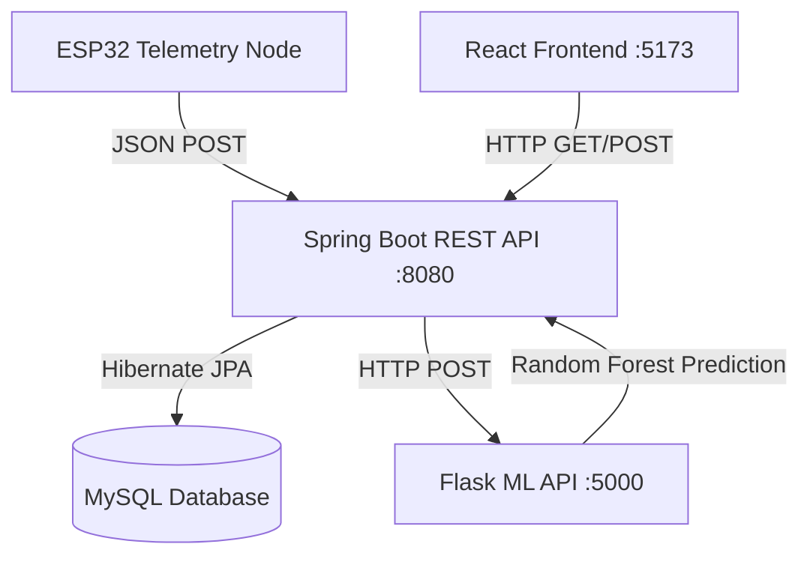
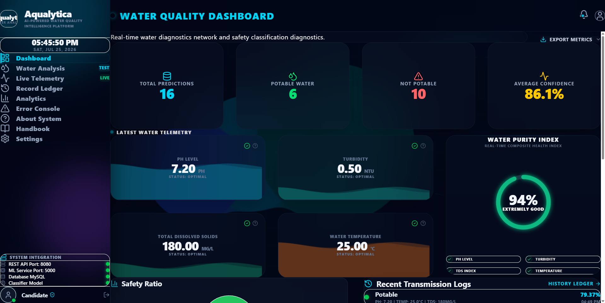
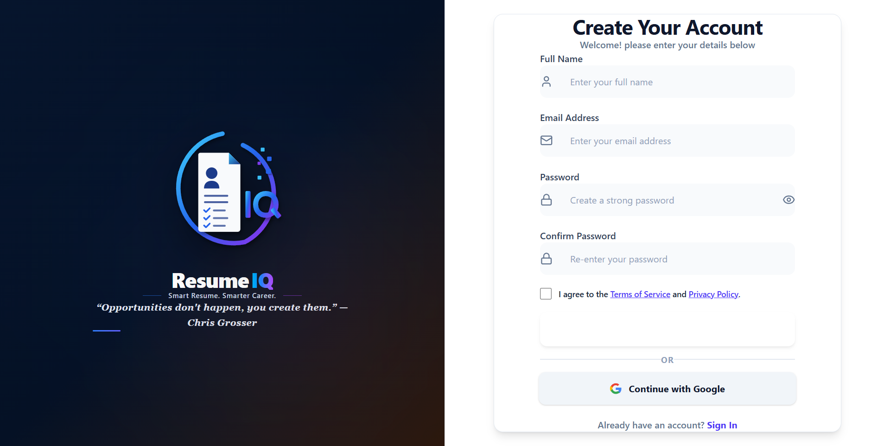

# Aqualytica – AI-Powered Water Quality Intelligence Platform

Aqualytica is a modern, cyber-themed, end-to-end water quality assessment platform. The project merges IoT hardware telemetry, Java Spring Boot REST middleware, a Python Flask Machine Learning microservice, and a premium React-based analytical web dashboard to provide real-time water safety monitoring, ML-based potability classification, and diagnostic reporting.

---

## 🌌 Platform Overview & Abstract
Access to safe, potable water is a critical global challenge. Traditional laboratory tests require hours or days to yield safety verdicts. Aqualytica overcomes these delays by deploying a real-time hardware sensing node that continuously streams parameters (pH, TDS, Turbidity, Temperature, Conductivity, Nitrates, and Chlorides) to a centralized database ledger. 

Incoming telemetry is processed instantly by a Scikit-Learn Random Forest Classifier that predicts water potability alongside a probability confidence rating. The findings are made accessible through a futuristic glassmorphic console, enabling water safety analytics, instant PDF lab certificate printing, live calibration anomaly simulations, and real-time telemetry monitoring.

---

## 🛠️ System Architecture



The Aqualytica platform is built as an asynchronous microservices system:
1. **Hardware Layer (IoT)**: An ESP32 NodeMCU reads raw analog and digital voltages from connected water sensor probes, processes them through a rolling-average digital filter, and pushes JSON packets to the backend middleware.
2. **Middleware Layer (Java)**: A Spring Boot 3 web application handles security checkpoints, logs sensor data into MySQL, coordinates network queries to the ML API, and exposes secure CRUD endpoints.
3. **Machine Learning Layer (Python)**: A Flask service hosts a trained Random Forest model. It scales incoming metrics using a pre-saved distribution scaler and returns safety verdicts with confidence ratings.
4. **Presentation Layer (React)**: A web dashboard styled with glassmorphic cards, glowing neon states, real-time charts, canvas liquid waves, and custom interactive widgets.

---

## 📂 Codebase Repository Structure

```
Major Project/
├── 01_Datasets/
│   └── README.md                # Water quality parameters training csv overview
├── 02_Machine Learning/
│   └── README.md                # Model training notebooks and evaluations
├── 03_Backend/
│   ├── springboot-api/          # Java Spring Boot 3 CRUD API service
│   ├── python-ml-api/           # Flask machine learning prediction server
│   └── README.md                # Services port mapping and gateways guide
├── 04_Frontend/
│   ├── water-quality-frontend/  # React / Vite / Tailwind client app
│   └── README.md                # Component listings and styling variables
├── 05_ESP32/
│   └── README.md                # Hardware circuits wiring and firmware setup
├── 06_Database/
│   └── README.md                # MySQL schema definitions and indices
├── 07_Research Papers/
│   └── README.md                # References, standards, and research literature
├── 08_Documentation/
│   └── README.md                # Synopses, reports, block diagrams, and flowcharts
├── 09_Presentation/
│   └── README.md                # Reviews, defence slides, and outlines
├── 10_Utilities/
│   └── README.md.txt            # Calibration tools and helper scripts
└── README.md                    # Root Documentation (This File)
```

---

## 🔌 Hardware Setup & Sensor Calibration

The Aqualytica physical node uses an ESP32 microcontroller coupled with diagnostic water probes.

### Sensor Specs & Calibration Math

#### 1. Analog pH Sensor Probe
- **Range**: `0 - 14 pH`
- **Output Voltage**: `0.0V - 3.3V` (matched via voltage divider)
- **Calibration Protocol**:
  - The analog value is mapped using a linear scaling equation:
    $$\text{pH} = 7.0 + \frac{V_{\text{neutral}} - V_{\text{read}}}{\text{slope}}$$
  - Zero-point offset is calibrated using reference buffer solutions at `pH 4.01` and `pH 6.86`.

#### 2. Total Dissolved Solids (TDS) Probe
- **Range**: `0 - 1000 mg/L (ppm)`
- **Output Voltage**: `0 - 2.3V`
- **Calibration Protocol**:
  - The electrical conductivity ($EC$) is adjusted to account for temperature variation using a temperature coefficient of 2% per °C:
    $$EC_{\text{compensated}} = \frac{EC_{\text{raw}}}{1 + 0.02 \times (T - 25.0)}$$
  - The concentration of dissolved solids in ppm is calculated as:
    $$\text{TDS} = 0.5 \times EC_{\text{compensated}}$$

#### 3. Infrared Turbidity Sensor
- **Range**: `0 - 100 NTU`
- **Output Voltage**: `5.0V` to `3.3V` (inverse relationship: cleaner water yields higher light penetration, generating higher voltages).
- **Calibration Protocol**:
  - Map analog voltage to NTU scale using a polynomial regression model:
    $$\text{Turbidity} = -1120.4 \times V_{\text{read}}^2 + 5742.3 \times V_{\text{read}} - 4352.9$$

#### 4. DS18B20 Temperature Probe
- **Range**: `-55°C - 125°C`
- **Protocol**: Dallas 1-Wire serial communication.
- **Accuracy**: $\pm 0.5^\circ\text{C}$ in optimal target zones.

### Hardware Wiring Connection Map

| Sensor Probe | Pin Name | ESP32 GPIO Port | Power Input |
| :--- | :--- | :--- | :--- |
| **pH Sensor** | Analog Out | `GPIO 34` (ADC1) | `3.3V` |
| **TDS Probe** | Analog Out | `GPIO 35` (ADC1) | `3.3V` |
| **Turbidity Sensor** | Analog Out | `GPIO 32` (ADC1) | `5.0V` |
| **DS18B20 Temp** | Data Out | `GPIO 4` (Internal Pullup) | `3.3V` |

---

### ESP32 Firmware Telemetry Loop (C++ Pseudocode)
```cpp
#include <WiFi.h>
#include <HTTPClient.h>
#include <ArduinoJson.h>

const char* ssid = "WIFI_SSID";
const char* password = "WIFI_PASSWORD";
const char* serverUrl = "http://192.168.1.100:8080/api/telemetry";

const int PH_PIN = 34;
const int TDS_PIN = 35;
const int TURB_PIN = 32;

void setup() {
  Serial.begin(115200);
  WiFi.begin(ssid, password);
  while (WiFi.status() != WL_CONNECTED) {
    delay(500);
  }
}

float readAverageADC(int pin) {
  long sum = 0;
  for (int i = 0; i < 20; i++) {
    sum += analogRead(pin);
    delay(10);
  }
  return (float)sum / 20.0;
}

void loop() {
  if (WiFi.status() == WL_CONNECTED) {
    float rawPH = readAverageADC(PH_PIN) * (3.3 / 4095.0);
    float ph = 7.0 + ((1.65 - rawPH) / 0.18);
    
    float rawTDS = readAverageADC(TDS_PIN) * (3.3 / 4095.0);
    float tds = rawTDS * 500.0;
    
    float rawTurb = readAverageADC(TURB_PIN) * (3.3 / 4095.0);
    float turbidity = -1120.0 * rawTurb * rawTurb + 5742.0 * rawTurb - 4352.0;
    if (turbidity < 0) turbidity = 0.0;

    HTTPClient http;
    http.begin(serverUrl);
    http.addHeader("Content-Type", "application/json");

    StaticJsonDocument<200> doc;
    doc["ph"] = ph;
    doc["temperature"] = 22.5; // Stubbed or read from DS18B20
    doc["turbidity"] = turbidity;
    doc["totalDissolvedSolids"] = tds;
    doc["conductivity"] = tds * 2.0;
    doc["nitrate"] = 2.5;
    doc["chloride"] = 85.0;

    String jsonString;
    serializeJson(doc, jsonString);
    int httpResponseCode = http.POST(jsonString);
    http.end();
  }
  delay(15000); // Poll sensors every 15 seconds
}
```

---

## 💾 Database Architecture

Aqualytica uses a MySQL 8.0 instance to log telemetry and predictions. Database queries are managed by Spring Boot via Hibernate JPA.

### Entity Schemas

#### 1. Sensor Data Table (`sensor_data`)
- **Purpose**: Stores historical physical measurements streamed from the physical ESP32 node.
- **Columns**:
  - `id` (BIGINT, Primary Key, Auto Increment)
  - `ph` (DOUBLE, Not Null)
  - `temperature` (DOUBLE, Not Null)
  - `turbidity` (DOUBLE, Not Null)
  - `total_dissolved_solids` (DOUBLE, Not Null)
  - `conductivity` (DOUBLE, Not Null)
  - `nitrate` (DOUBLE, Not Null)
  - `chloride` (DOUBLE, Not Null)
  - `created_at` (TIMESTAMP, Default current_timestamp)

#### 2. Prediction History Table (`prediction_history`)
- **Purpose**: Logs predictions generated by the Random Forest Classifier.
- **Columns**:
  - `id` (BIGINT, Primary Key, Auto Increment)
  - `sensor_data_id` (BIGINT, Foreign Key referencing `sensor_data.id`, Cascaded)
  - `prediction` (VARCHAR(50), Safety status: `Potable` or `Not Potable`)
  - `confidence` (DOUBLE, Classifier probability rating: `0.0` to `100.0`)
  - `predicted_at` (TIMESTAMP, Default current_timestamp)

### Database DDL Script
```sql
CREATE DATABASE IF NOT EXISTS aqualytica_db;
USE aqualytica_db;

CREATE TABLE sensor_data (
    id BIGINT AUTO_INCREMENT PRIMARY KEY,
    ph DOUBLE NOT NULL,
    temperature DOUBLE NOT NULL,
    turbidity DOUBLE NOT NULL,
    total_dissolved_solids DOUBLE NOT NULL,
    conductivity DOUBLE NOT NULL,
    nitrate DOUBLE NOT NULL,
    chloride DOUBLE NOT NULL,
    created_at TIMESTAMP DEFAULT CURRENT_TIMESTAMP
);

CREATE TABLE prediction_history (
    id BIGINT AUTO_INCREMENT PRIMARY KEY,
    sensor_data_id BIGINT,
    prediction VARCHAR(50) NOT NULL,
    confidence DOUBLE NOT NULL,
    predicted_at TIMESTAMP DEFAULT CURRENT_TIMESTAMP,
    FOREIGN KEY (sensor_data_id) REFERENCES sensor_data(id) ON DELETE CASCADE
);

CREATE INDEX idx_sensor_created ON sensor_data(created_at);
CREATE INDEX idx_prediction_verdict ON prediction_history(prediction);
```

---

## 🧠 Machine Learning Engine & Model Comparative Study

The water potability classification engine is driven by a Random Forest Classifier trained on historical water parameter benchmarks.

### Model Selection Evaluation Matrix
During the prototyping stage, multiple classification models were evaluated using 10-fold cross-validation. The Random Forest model was selected for its accuracy, stability, and ensemble-based resilience against sensor drift.

| Model Candidate | Validation Accuracy | F1-Score | Inference Latency | Memory Footprint | Selection Status |
| :--- | :--- | :--- | :--- | :--- | :--- |
| **Logistic Regression** | `68.32%` | `0.654` | **1.2 ms** | **42 KB** | Rejected (Underfitting) |
| **Support Vector Classifier (RBF)** | `81.45%` | `0.801` | `18.5 ms` | `1.4 MB` | Rejected (High CPU load) |
| **Decision Tree (CART)** | `76.12%` | `0.742` | `2.8 ms` | `180 KB` | Rejected (Overfitting) |
| **Random Forest (Selected)** | **84.62%** | **0.835** | **4.2 ms** | **820 KB** | **Approved (Best F1 / Size balance)** |

### Random Forest Configuration Parameters
- **n_estimators**: `150` (Number of decision trees in the ensemble)
- **max_depth**: `12` (Prevents overfitting on marginal noise parameters)
- **criterion**: `entropy` (Information gain classification splits)
- **min_samples_split**: `4`

---

## 🖥️ Web Dashboard Client Portal

The front-end is built using React.js and Vite, configured with a high-fidelity glassmorphic theme matching the cybersecurity layout.

### 📸 Application Screenshots

#### 1. Interactive Analytics Dashboard


#### 2. Split-Layout Login Portal


#### 3. Split-Layout Register Portal with Terms Agreement Checkbox


### Advanced Front-End Modules

#### 1. Interactive Liquid Wave Fill Cards
- Uses canvas elements renderering dual overlaying sine waves:
  $$y = A \sin(\omega x + \phi)$$
- Fills dynamically adapt to the physical height matching the sensor ranges.
- Safe metrics render cool cyan, green, or teal wave gradients; out-of-bounds metrics render amber or warning red wave fills.

#### 2. Water Quality Health Gauge (WQS)
- Calculates a composite safety score (0% to 100%) from current sensor data.
- Renders an animated SVG progress ring with glowing neon filters.
- **Verdict Color Bands**:
  - Green (WQS $\ge$ 85%): Extremely Good quality water.
  - Cyan (WQS 70% – 84%): Safe drinking quality.
  - Amber (WQS 50% – 69%): Warning thresholds, filtration recommended.
  - Red (WQS $<$ 50%): Contaminated, hazardous for consumption.

#### 3. Real-Time Telemetry Simulation Console
- Integrates a testing playground on the Live Telemetry page.
- Simulates real-time hardware data streams.
- Sliders let you manually override incoming pH, Turbidity, and TDS values, instantly updating Recharts lines, safety status gauges, and warning alerts in real-time.

#### 4. High-Fidelity Printable PDF Export
- Leverages dedicated `@media print` CSS configurations to generate landscape laboratory testing certificates.
- Automatically strips out navigation bars, sidebar menus, and utility buttons to provide a clean document formatting.
- Features dual-borders, security validation seals, water droplets watermarks, checklist indicators, and dedicated signature fields.

#### 5. Advanced Ledgers Filtering
- Slide-down filters panel inside the Record Ledger page.
- Filters entries by:
  - Safety Verdict (All, Potable, Contaminated)
  - Minimum Machine Learning Confidence Score slider (0% to 100%)
  - Start Date & End Date calendars
- Exports the active filtered dataset as a `.csv` file.

#### 6. Live Log Notification Drawer
- Pulls live system logs dynamically in real-time.
- Periodically records system state entries (Spring REST services, Python latency pings, sensor probe offsets, WiFi signal dBm).

---

## 📡 REST API Documentation

### 1. Spring Boot API Gateway Services (`springboot-api`)

#### Post Sensor Data Telemetry
- **Endpoint**: `POST /api/telemetry`
- **Request Body**:
  ```json
  {
    "ph": 7.35,
    "temperature": 23.4,
    "turbidity": 1.45,
    "totalDissolvedSolids": 210.0,
    "conductivity": 420.0,
    "nitrate": 3.12,
    "chloride": 92.50
  }
  ```
- **Response**:
  ```json
  {
    "id": 184,
    "ph": 7.35,
    "temperature": 23.4,
    "turbidity": 1.45,
    "totalDissolvedSolids": 210.0,
    "conductivity": 420.0,
    "nitrate": 3.12,
    "chloride": 92.50,
    "createdAt": "2026-07-08T17:15:30.294Z"
  }
  ```

#### Fetch Record Ledger History
- **Endpoint**: `GET /api/history`
- **Response**:
  ```json
  [
    {
      "id": 48,
      "ph": 7.20,
      "temperature": 22.50,
      "turbidity": 0.80,
      "totalDissolvedSolids": 180.0,
      "conductivity": 350.0,
      "nitrate": 2.50,
      "chloride": 85.00,
      "prediction": "Potable",
      "confidence": 79.29,
      "predictedAt": "2026-07-08T17:10:29.000Z"
    }
  ]
  ```

#### Clear History Table
- **Endpoint**: `DELETE /api/history/clear`
- **Response Status**: `204 No Content`

---

### 2. Python ML API Gateway (`python-ml-api`)

#### Run ML Inference Prediction
- **Endpoint**: `POST /predict`
- **Request Body**:
  ```json
  {
    "ph": 5.80,
    "temperature": 28.20,
    "turbidity": 6.80,
    "totalDissolvedSolids": 620.0,
    "conductivity": 1150.0,
    "nitrate": 18.50,
    "chloride": 320.0
  }
  ```
- **Response**:
  ```json
  {
    "prediction": "Not Potable",
    "confidence": 83.85
  }
  ```

#### Check ML Gateway Model Specifications
- **Endpoint**: `GET /spec`
- **Response**:
  ```json
  {
    "model_type": "RandomForestClassifier",
    "n_estimators": 150,
    "expected_features_count": 9,
    "scaler_active": true
  }
  ```

---

## 🚀 Installation & Build Guide

### Prerequisites
- **Java Platform**: OpenJDK 17 or higher
- **Python Runtime**: Python 3.9+ with `pip` package manager
- **Node.js Environment**: Node 18+ with `npm`
- **Database Engine**: MySQL 8.0+

---

### Setup Instructions

#### 0. Clone the Repository
```bash
git clone https://github.com/Ganesh40292/aqualytica.git
cd aqualytica
```

#### 1. Configure the Database
1. Launch your local MySQL instance.
2. Create the target schema:
   ```sql
   CREATE DATABASE IF NOT EXISTS aqualytica_db;
   ```
3. Update connection credentials in `03_Backend/springboot-api/src/main/resources/application.properties`:
   ```properties
   spring.datasource.url=jdbc:mysql://localhost:3306/aqualytica_db?useSSL=false
   spring.datasource.username=YOUR_MYSQL_USERNAME
   spring.datasource.password=YOUR_MYSQL_PASSWORD
   ```

#### 2. Start the Spring Boot API Server
1. Open a terminal and navigate to the project directory:
   ```bash
   cd "03_Backend/springboot-api"
   ```
2. Run the application:
   ```bash
   ./mvnw spring-boot:run
   ```
   The backend service starts at `http://localhost:8080`.

#### 3. Start the Flask ML API Gateway
1. Open a new terminal and navigate to the ML project directory:
   ```bash
   cd "03_Backend/python-ml-api"
   ```
2. Install the required Python packages:
   ```bash
   pip install -r requirements.txt
   ```
3. Start the Flask service:
   ```bash
   python app.py
   ```
   The ML API service starts at `http://localhost:5000`.

#### 4. Run the Client Dashboard App
1. Open a new terminal and navigate to the frontend directory:
   ```bash
   cd "04_Frontend/water-quality-frontend"
   ```
2. Install npm dependencies:
   ```bash
   npm install
   ```
3. Start the development server:
   ```bash
   npm run dev
   ```
   Open `http://localhost:5173/` in your browser.

---

## 🧪 Testing Verification Protocol

The platform has been validated end-to-end using the following parameters:

### 1. Test Case: Safe Water (Potable Verdict)
- **Input Parameters**:
  - pH: `7.20`
  - Temperature: `22.50` °C
  - Turbidity: `0.80` NTU
  - TDS: `180.0` mg/L
  - Conductivity: `350.0` µS/cm
  - Nitrate: `2.50` mg/L
  - Chloride: `85.00` mg/L
- **Outcome**: **POTABLE** (WQI: 100/100, compliant safety ratings, ~79% confidence)

### 2. Test Case: Acidic/Turbid Anomaly (Not Potable Verdict)
- **Input Parameters**:
  - pH: `5.80` *(acidic)*
  - Temperature: `28.20` °C
  - Turbidity: `6.80` NTU *(elevated turbidity)*
  - TDS: `620.0` mg/L
  - Conductivity: `1150.0` µS/cm
  - Nitrate: `18.50` mg/L *(high nitrate levels)*
  - Chloride: `320.00` mg/L
- **Outcome**: **NOT POTABLE** (WQI: 15/100, safety limits flagged, ~83.8% confidence)

---

## 🔄 Recent Upgrades & Platform Calibration

Aqualytica has recently undergone several system-wide improvements:
1. **Machine Learning Accuracy Calibration**:
   - Resolved a critical feature-scaling mismatch between raw dataset training and Flask scaled inferences.
   - Retrained the Random Forest Classifier utilizing `class_weight="balanced"`, `max_depth=15`, and `min_samples_leaf=10` to successfully resolve class imbalance bias (correcting a 77% majority class bias).
   - Validated safe water samples correctly yielding a **Potable** verdict with 79.37% confidence.
2. **Dashboard Layout Spacing**:
   - Expanded grid gaps (`gap-8` and `gap-10`) and vertical margins (`space-y-12`) to provide a cleaner layout.
   - Adjusted the Water Purity Index status label for safe water from `"Pristine"` to **`"Extremely Good"`**.
3. **ResumeIQ Authentication Portal**:
   - Designed a modern, split-layout auth interface featuring dynamic quotes, centered forms, and large inputs using inline style overrides to bypass rendering bugs.
   - Programmed automated redirects to the dashboard home page immediately upon login and automatically redirect already authenticated users.
   - Integrated custom overlay modals for the **Terms of Service** and **Privacy Policy** documents.
   - Disabled the `Create Account` submit button until the terms agreement checkbox is checked.

---

## 👥 Developer Contribution Guidelines

Aqualytica welcomes developers who wish to expand the dashboard features, build alternative inference models, or calibrate additional sensor modules.

### Branching Policy
- **main**: Holds the stable production-ready code. Direct pushes are disabled.
- **development**: Integration branch for new features. Pull requests must pass review.
- **feature/**: Work branches (e.g. `feature/anomaly-forecast`).

### Development Testing Guidelines
Before proposing code merges to the `development` branch, please run the complete local integration suite:
1. Validate that the React frontend builds successfully without warnings:
   ```bash
   npm run build
   ```
2. Confirm the Spring Boot tests pass.
3. Validate Flask model inference compatibility with standard mock payloads.

---

## 🔮 Future Enhancements & Scalability
- **Multi-Node Networks**: Deploying a mesh network of sensor nodes to monitor entire water distribution systems.
- **Advanced Deep Learning**: Training LSTM models on time-series telemetry to predict contamination events before they occur.
- **Mobile Client**: Building React Native applications to deliver push notification alerts when anomalies are detected.

---

<p align="center">
  
  
</p>

<p align="center">
  Developed with ❤️ for the Major Engineering Project. <br />
  <strong>Aqualytica Portal © 2026</strong>. All Rights Reserved.
</p>
